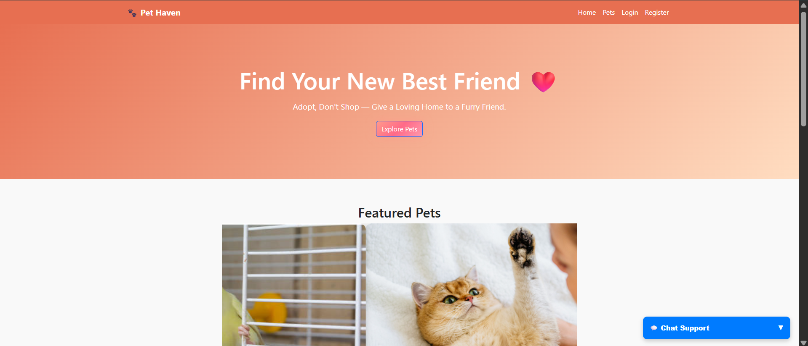
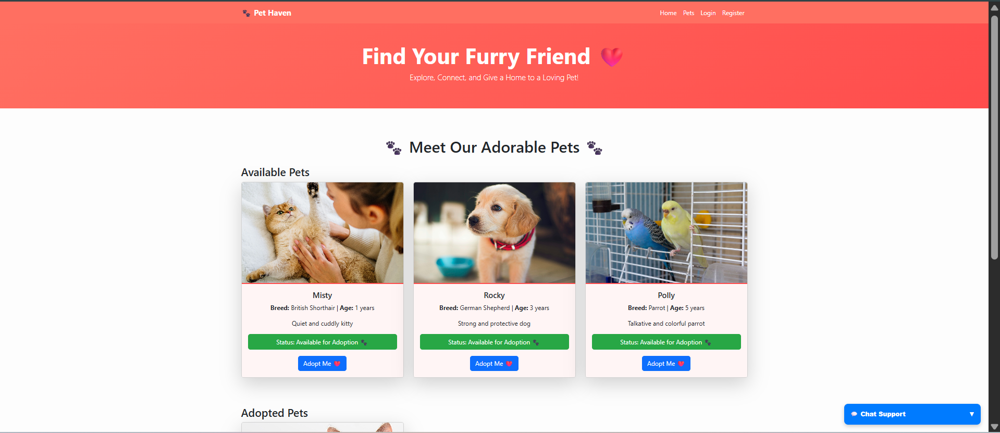
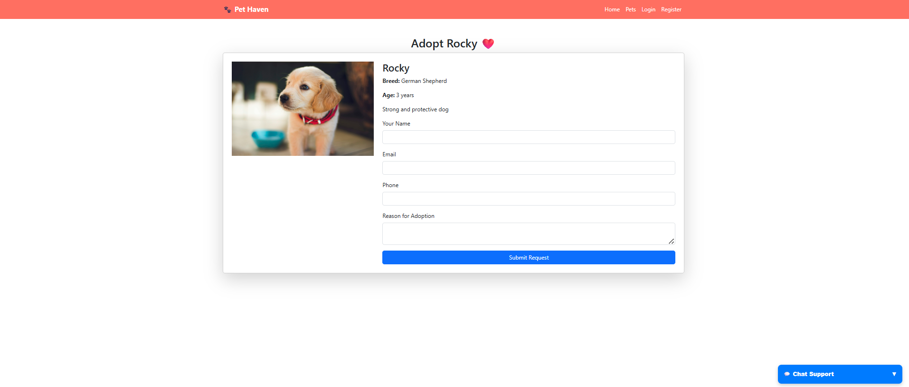

# 🐾 Pet Adoption System

The **Pet Adoption System** is a full-stack web application developed to connect abandoned, shelter, or rescued pets with potential adopters.
It provides a user-friendly platform where users can explore pet profiles, apply for adoption, and help pets find loving homes.

---

## 🚀 Features

- 🐶 **Pet Listings**: View pet profiles with images, breed, age, gender, health, and more.
- 🔍 **Search & Filter**: Find pets based on specific criteria like type, breed, age, or size.
- 📝 **Adoption Form**: Fill out and submit adoption applications directly from the site.
- 👤 **User Authentication**: Sign up and log in securely to apply for adoptions.
- 🔐 **Admin Dashboard**: Admin can manage pet listings, view adoption requests, and more.
- 💬 **Contact Form / Support**: Get in touch with shelter or site admins.
- 📱 **Responsive Design**: Mobile-friendly UI using Bootstrap for better UX across devices.

---

## 🛠 Tech Stack
| HTML5     
| CSS3   
| JavaScript 
| Bootstrap 
| PHP    
| MySQL

---

## ⚙️ Installation Steps

### ✅ Prerequisites:
- XAMPP / WAMP installed
- PHP 7.x or later
- MySQL
- Git (optional)

### 📦 Setup Instructions:

1. **Clone the repository**  
   bash
   git clone https://github.com/Ruditha/pet_adoption_system.git

2. **Move to htdocs folder**

   bash
   cp -r pet_adoption_system C:/xampp/htdocs/
 

3. **Start XAMPP**

   * Open XAMPP Control Panel
   * Start **Apache** and **MySQL**

4. **Create the Database**

   * Go to http://localhost/phpmyadmin
   * Create a database named pet_adoption
   * Import sql/database_schema.sql into the DB

5. **Run the App**
   Open your browser and go to:

   http://localhost/pet_adoption_system/
---

## 👤 User Roles

### 🧍‍♂️ User

* Can view pets
* Can register/login
* Can submit adoption requests

### 👩‍💼 Admin

* Can log in to dashboard
* Add/edit/delete pet profiles
* View/manage adoption requests

---

## 📸 Screenshots

| Home Page                        | Pet Listing                      | Adoption Form                    |
| -------------------------------- | -------------------------------- | -------------------------------- |
|  |  |  |

---

## 💡 Future Enhancements

* OTP or email verification
* Chat with pet shelters
* Admin analytics dashboard
* Pet health and vaccination history
* Integration with payment gateways for donations

---

## 📬 Contact

**Vilvashini Thirukanimuthu**
📧 [vilvashinit.23csd@kongu.edu](mailto:vilvashinit.23csd@kongu.edu)
🌐 [LinkedIn](https://www.linkedin.com/in/vilvashini-thirukanimuthu-0b39b1303/) | [GitHub](https://github.com/Ruditha)

---

